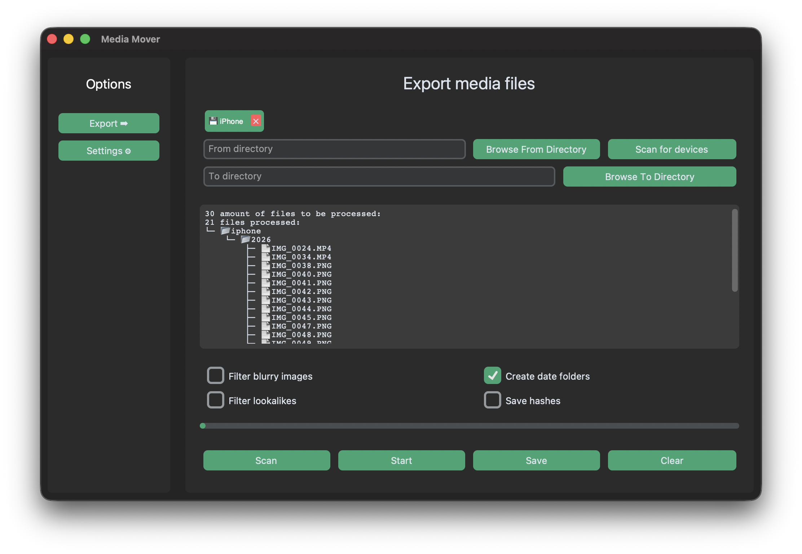
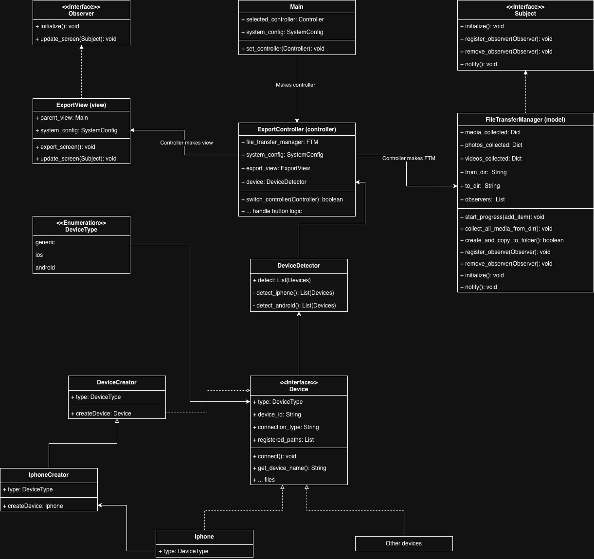

# Media Mover App

A desktop application for collecting and organizing media from mobile devices and hard drives, starting with iPhone support.

**Media Mover App** helps you move photos and videos from your phone into a structured folder system based on metadata such as creation date, camera type, and device information.



The goal is simple:

> **Move and organize your media automatically with minimal manual sorting.**

## Features

### 📱 iPhone Media Import

- Connect an iPhone via USB
- Detect media from the device
- Import:
  - Photos
  - Videos

### 🗂 Automatic Folder Organization

Files can automatically be grouped into folders using metadata:

Examples:

```txt
2025/
└── iphone_se_3rd_generation/
    └── selfie/
        └── IMG_1234.HEIC
```

## Diagrams

The application was intentionally designed with **scalability and device abstraction in mind**.

Although the current implementation supports **iPhone devices and file locations**, the internal architecture is built to make supporting additional device types straightforward.


